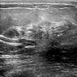
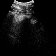
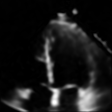
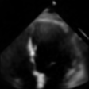
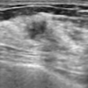
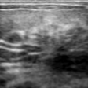
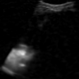

# VidFuncta_public

This repo contains the official Pytorch implementation of the paper *VidFuncta*.
 

## Data
-The Echonet Dynamic dataset can be downloaded [here](https://aimi.stanford.edu/datasets/echonet-dynamic-cardiac-ultrasound)

-The Breast Ultrasound Video dataset can be downloaded [under this link](https://github.com/jhl-Det/CVA-Net/tree/main](https://github.com/jhl-Det/CVA-Net/tree/main )  

-The BEDLUS dataset of lung ultrasound videos can be required [here](https://www.dropbox.com/scl/fi/ztzo9pt8i81ad1uz73x27/BEDLUS-data-instructions.pdf?rlkey=jxndke0vesoyg8wn28wydlwdz&e=1&dl=0 )

A mini-example how the data needs to be stored can be found in the folder *data*. 

### Training of the Meta-Model
Training configurations are stored in the folder *configs/experiments*
- To run the training of the our VidFuncta approach, `python3 train.py --config ./configs/experiments/2d_imgs/lung.yaml` .
- To run the training of the 3D approach, `python3 train.py --config ./configs/experiments/3d_imgs/lung_3d.yaml` .
- To run the training of the spatial approach, `python3 train_spatial.py --config ./configs/experiments/2d_imgs/lung_spatial.yaml` .

The trained models will be stored in a folder *logs*.

### Inference and saving of the modulation vectors

- To store the modulations and reconstruct the videos, run
`python3 rescontruct.py --config ./configs/reconstruct/lung_reconstruct.yaml`

 The output will be stored in a folder *reconstructions*.

## Detailed Results
The first row shows the model input, the second rew the reconstructed videos using a model trained on the mixed dataset.
<table>
  <tr>
    <td></td>
    <td></td>
    <td></td>
    <td></td>
    <td></td>
    <td></td>
  </tr>
  <tr>
    <td></td>
    <td></td>
    <td></td>
    <td></td>
    <td></td>
    <td></td>
  </tr>
</table>

.png)

## Comparing Methods
### PocovidNet
We adapted the code repository available  [here](https://github.com/jannisborn/covid19_ultrasound), using the video classification approach.

### Res2+1D
The Res2+1D architecture was adopted from ...

### MedFuncta
This Github repository was based on MedFuncta available [here](https://github.com/pfriedri/medfuncta).

### Spatial Functa
We followed the description in the paper [Spatial Functa](https://arxiv.org/abs/2302.03130) to extract modulation vectors of dimension 4x4x64.

